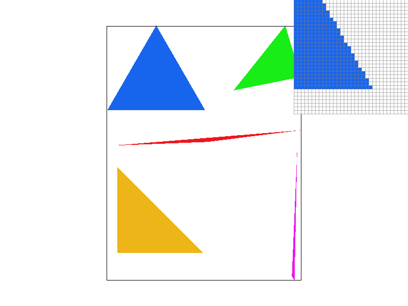
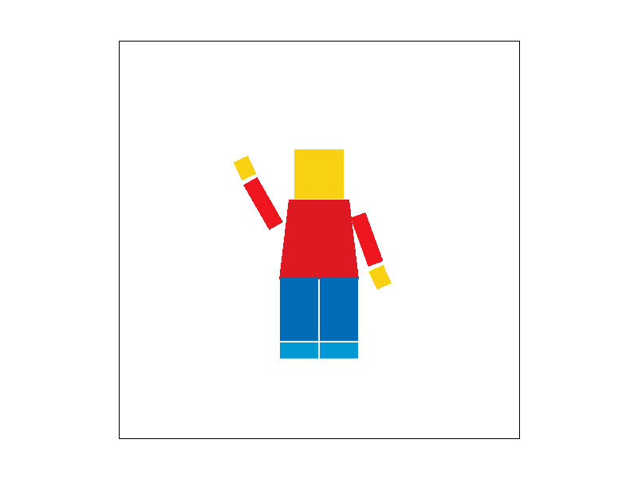
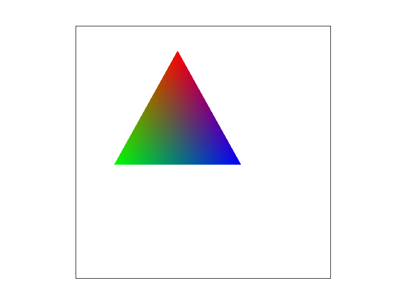
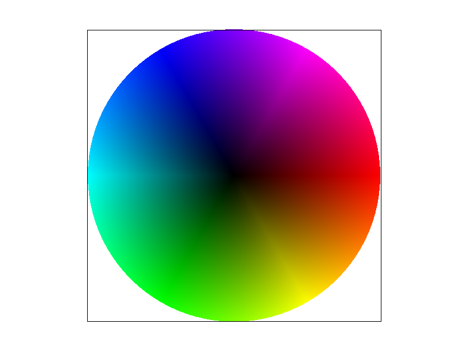

# CS184 Project 1 Rasterizer
## Cyrus Vachha (3034867551)
### Spring 2022 

## Overview
This project

## Section I: Rasterization

### Part 1: Rasterizing single-color triangles

**Walk through how you rasterize triangles in your own words**

My algorithm rasterizes by finding the “bounding box” of the triangle to render given the three points by finding the min and max of the x and y coordinates (this is to find a range of values to sample from and reduce the number of calls). Then it iterates over each point in the bounding box and checks if it is in the triangle using the given indicator equations in Lecture 2. Then, it samples from the image to get the corresponding color, and then it fills the pixel at that location when I call rasterize_point. To ensure that the triangle is rasterized whether it is in clockwise or counterclockwise directions, I check if L_i > 0 or if L_i < 0 for 0 <= i <= 2.

**Explain how your algorithm is no worse than one that checks each sample within the bounding box of the triangle**

My algorithm first finds the “bounding box” of the triangle to render given the points (xi,yi) 0 <= i =< 2 by finding the min and max of the x and y coordinates (this is to find a range of values to sample from and reduce the number of calls).Then it iterates over each point in the box and checks if it is in the triangle and samples the color to fill the pixel.

**Show a png screenshot of basic/test4.svg with the default viewing parameters and with the pixel inspector centered on an interesting part of the scene.**

Here the jagged edges of the triangle side are visible.

### Part 2: Antialiasing triangles

**Walk through your supersampling algorithm and data structures. Why is supersampling useful? What modifications did you make to the rasterization pipeline in the process? Explain how you used supersampling to antialias your triangles.**

**Show png screenshots of basic/test4.svg with the default viewing parameters and sample rates 1, 4, and 16 to compare them side-by-side. Position the pixel inspector over an area that showcases the effect dramatically; for example, a very skinny triangle corner. Explain why these results are observed. **

### Part 3: Transforms

**Create an updated version of svg/transforms/robot.svg with cubeman doing something more interesting, like waving or running. Feel free to change his colors or proportions to suit your creativity. Save your svg file as my_robot.svg in your docs/ directory and show a png screenshot of your rendered drawing in your write-up. Explain what you were trying to do with cubeman in words.**

I transformed my robot to resemble a Lego Minifigure and accordingly scaled and rotated the components as well as changed the scaling of one of the edges for the torso by changing the triangle points.

## Section II: Sampling

### Part 4: Barycentric coordinates

**Explain barycentric coordinates in your own words and use an image to aid you in your explanation. One idea is to use a svg file that plots a single triangle with one red, one green, and one blue vertex, which should produce a smoothly blended color triangle.**

Barycentric coordinates are points that represent the proportional distance of a specific point relative to other given points (vertices of the triangle in this case) as a weighted average.

I implemented this by using a similar rasterization method as the initial raseterize_triange function, and then to choose the color, I used the linear interpolation formulas to calculate alpha, beta, and gamma to construct the blended color, interpolated from the colors from each of the three vertices.

Essentially it is an interpolation between the vertices. In this example we are creating a color wheel which gives us a color gradient and blend of many colors. Here, at every pixel, we use Barycentric coordinates to interpolate between the color RGB values to get a smooth interpolation across the colors.

To demonstrate this up close, I edited the color wheel svg file to include just one color triangle where I set each vertex to Red, Green, and Blue individually. Here, we can see how at each vertex one full color channel is present while the other two color channels are missing. Each pixel in the triangle displays the colors of the weighted averages of the distances from each vertex corner. For example, the top vertex is colored pure Red while the midpoint of the left side of the triangle is primarily a combination of Red and Green. The center point would be a combination of all three colors equally.

**Show a png screenshot of svg/basic/test7.svg with default viewing parameters and sample rate 1. If you make any additional images with color gradients, include them.**

### Part 5: "Pixel sampling" for texture mapping

### Part 6: "Level sampling" with mipmaps for texture mapping

## Section III: Art Competition

### Part 7: Draw something interesting!

