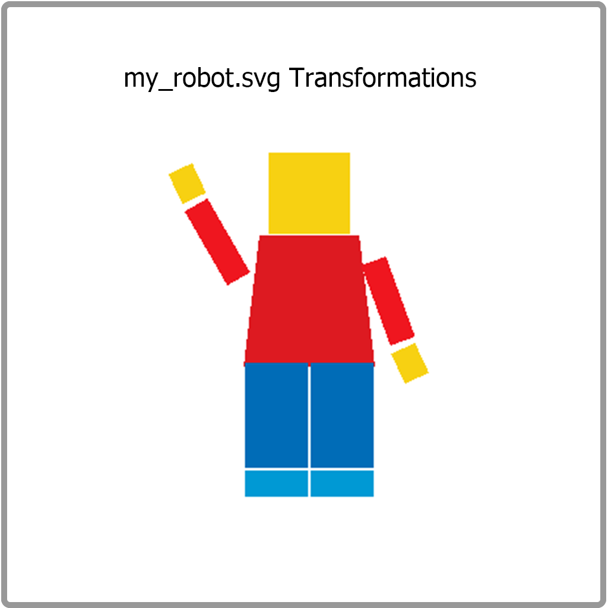

# CS184 Project 1 Rasterizer
## Cyrus Vachha (3034867551)
### Spring 2022 

## Overview
This project creates a rasterizer.

## Section I: Rasterization

### Part 1: Rasterizing single-color triangles

**Walk through how you rasterize triangles in your own words**

My algorithm rasterizes by finding the “bounding box” of the triangle to render given the three points by finding the min and max of the x and y coordinates (this is to find a range of values to sample from and reduce the number of calls). Then it iterates over each point in the bounding box and checks if it is in the triangle using the given indicator equations in Lecture 2. Then, it samples from the image to get the corresponding color, and then it fills the pixel at that location when I call rasterize_point. To ensure that the triangle is rasterized whether it is in clockwise or counterclockwise directions, I check if L_i > 0 or if L_i < 0 for 0 <= i <= 2. 

**Explain how your algorithm is no worse than one that checks each sample within the bounding box of the triangle**

My algorithm first finds the “bounding box” of the triangle to render given the points (xi,yi) 0 <= i =< 2 by finding the min and max of the x and y coordinates (this is to find a range of values to sample from and reduce the number of calls).Then it iterates over each point in the box and checks if it is in the triangle and samples the color to fill the pixel.

**Show a png screenshot of basic/test4.svg with the default viewing parameters and with the pixel inspector centered on an interesting part of the scene.**

Here the jagged edges of the triangle side are visible.

### Part 2: Antialiasing triangles

**Walk through your supersampling algorithm and data structures. Why is supersampling useful? What modifications did you make to the rasterization pipeline in the process? Explain how you used supersampling to antialias your triangles.**

Supersampling is a method of anti aliasing which increases the visual quality of an image by rendering a higher resolution image and down sampling it to remove jagged edges. This allows us to view images at a simulated higher resolution and image quality by showing smoother edges.

In my project, I implemented supersampling by first coming up with a structure to facilitate a dynamic sample buffer that would change its size when supersampling was active. The sample_buffer would scale according to the sample_rate given by the user, and the svg would rasterize on to the scaled sample_buffer. To render the image, the sample_buffer would be downsampled back down to its original size by finding the average color of the sqrt(sample_rate) x sqrt(sample_rate) pixel blocks. The sample_buffer acts as a large array (of length width*height*sample_rate) that takes in pixel Color vectors. The rgbframebuffer is a large array that takes in the individual RGB values of the pixel to rasterize the image in its original coordinates.

I first edited the `set_sample_rate` and implemented the `resolve_framebuffer` function. The `resolve_framebuffer` function would sample the average color of pixels from blocks the size of the sampling rate (2x2 for 4/pixel or 4x4 for 16/pixel) from the sample buffer. These values are written to the final rgbframebuffer which will display the downsampled image. 

Then, I updated my rasterize_triange function to support rasterizing onto the new samplebuffer. To do this, I would scale each of the coordinates of the triangle according to the square root of the sampling rate. For example to translate original coordinates to the new scaled sample buffer coordinates (x0, y0) -> (sample_rate*x0, sample_rate*y0). I then realized that I needed to create a new method of filling in the pixels into the sample buffer, so I adapted the rasterize_point and fill_pixel function to fit in the rasterize_triangle function and edited the indices in the sample buffer assignment to take the sample_rate into account: `sample_buffer[sy * (width * sqrt(sample_rate) + sx] = color`.

When I ran this, I noticed that the test1 flower svg image, border lines, and color wheel started to fade into the background as I increased the sampling rate, so I removed the anti aliasing from the points and lines by editing the fill_pixel function to rasterize a pixel block of sqrt(sample_rate) x sqrt(sample_rate) for each pixel it is called on. This essentially rasterized the same pixel in a pixel block so when downsampled it remained the same pixel color value.

To prevent the rasterize window from crashing when resizing it, I edited the `set_framebuffer_target` to resize the sample_buffer by an additional factor of the sample_rate.

I added a few other changes to adjust for any unexpected issues from the above changes and tried my best to prevent any random crashes or memory errors (which I encountered frequently when writing these functions). I finally applied these changes to the rest of the rasterize_triange variant functions (color interpolation and texture mapping).

When applying supersampling to the triangles and images, it has a subtle, but noticeable improvement on the edges and gives the entire image a higher resolution look despite it being the same resolution as a non supersampled image. For instance, the cube (test5.svg) looks much cleaner and less pixelated by having smoother edges.

**Show png screenshots of basic/test4.svg with the default viewing parameters and sample rates 1, 4, and 16 to compare them side-by-side. Position the pixel inspector over an area that showcases the effect dramatically; for example, a very skinny triangle corner. Explain why these results are observed.**

I chose to focus on one of the thin edges of a red triangle to find visible differences in increasing supersampling. As the sampling increases it shows the jagged staircase-like edge transform into a smoother and softer line with pixels that blend the white background into the red triangle better. Because the rasterizer renders a higher resolution image, it obtains additional information about the pixels in those areas and accordingly adjusts its color when it is scaled down to reflect what pixels would have been visible when it was rendered as a larger image. Therefore, the pixels seem smoother and softer at the edges.

### Part 3: Transforms

**Create an updated version of svg/transforms/robot.svg with cubeman doing something more interesting, like waving or running. Feel free to change his colors or proportions to suit your creativity. Save your svg file as my_robot.svg in your docs/ directory and show a png screenshot of your rendered drawing in your write-up. Explain what you were trying to do with cubeman in words.**

I transformed my robot to resemble a Lego Minifigure and accordingly scaled and rotated the components as well as changed the scaling of one of the edges for the torso by changing the triangle points.

## Section II: Sampling

### Part 4: Barycentric coordinates

**Explain barycentric coordinates in your own words and use an image to aid you in your explanation. One idea is to use a svg file that plots a single triangle with one red, one green, and one blue vertex, which should produce a smoothly blended color triangle.**

Barycentric coordinates are points that represent the proportional distance of a specific point relative to other given points (vertices of the triangle in this case) as a weighted average.

I implemented this by using a similar rasterization method as the initial raseterize_triange function, and then to choose the color, I used the linear interpolation formulas to calculate alpha, beta, and gamma to construct the blended color, interpolated from the colors from each of the three vertices.

Essentially it is an interpolation between the vertices. In this example we are creating a color wheel which gives us a color gradient and blend of many colors. Here, at every pixel, we use Barycentric coordinates to interpolate between the color RGB values to get a smooth interpolation across the colors.

To demonstrate this up close, I edited the color wheel svg file to include just one color triangle where I set each vertex to Red, Green, and Blue individually. Here, we can see how at each vertex one full color channel is present while the other two color channels are missing. Each pixel in the triangle displays the colors of the weighted averages of the distances from each vertex corner. For example, the top vertex is colored pure Red while the midpoint of the left side of the triangle is primarily a combination of Red and Green. The center point would be a combination of all three colors equally.

**Show a png screenshot of svg/basic/test7.svg with default viewing parameters and sample rate 1. If you make any additional images with color gradients, include them.**

### Part 5: "Pixel sampling" for texture mapping

**Explain pixel sampling in your own words and describe how you implemented it to perform texture mapping. Briefly discuss the two different pixel sampling methods, nearest and bilinear.**

Pixel sampling is the process of selecting/sampling colors of pixels from a reference and is used in texture mapping to correctly place pixels from an image texture to a face, mesh or destination object.There are two pixel sampling methods I implemented: nearest and bilinear.

Nearest pixel sampling will sample the nearest pixel from the translated UV coordinate and obtain the texel color closest to the pixel location. 

Bilinear pixel sampling will sample the four nearest pixels from the translated UV point and take the weighted average of their texel colors (interpolated color across the four pixels using Barycentric coordinate equations vertically and horizontally).

I implemented texture mapping by first adapting the rasterize_triangle function to use the `SampleParams` struct to call the `tex.sample` and creating appropriate if statements to call the corresponding pixel sampling functions. The `SampleParams` struct contains UV information and the user’s selected method of pixel sampling.

To implement nearest pixel sampling in `sample_nearest`, I took in the UV coordinates and multiplied them by the height and width of the mip to get the translated coordinates. Using these coordinates, I got and returned the texel color at that location from the image. 

To implement bilinear sampling in `sample_bilinear`, I find the four closest pixels to the UV point by finding which “quadrant” of the pixel the UV point lies in. I then accordingly sample the colors at those four pixels by taking the weighted average through color interpolation equations (lerp formulas performed vertically and horizontally)

This diagram I made demonstrates how I chose the four closest pixels. I check the decimal part of the UV position (a float) and check whether it is beyond or under 0.5 in both axes. 

Once I also manage “edge” cases where I interpolate between a fewer amount of pixels when the UV coordinate is close to the edges, I return the color.

**Check out the svg files in the svg/texmap/ directory. Use the pixel inspector to find a good example of where bilinear sampling clearly defeats nearest sampling. Show and compare four png screenshots using nearest sampling at 1 sample per pixel, nearest sampling at 16 samples per pixel, bilinear sampling at 1 sample per pixel, and bilinear sampling at 16 samples per pixel.**

There would be a large noticeable difference between the two methods when there are gaps between the pixels and with reduced anti-aliasing settings. As shown above, the bilinear sampling shows a smoother and more continuous interpolation of the gold colors, compared to the nearest pixel sampling that preserves the white gaps between the pixels despite the supersampling levels. Additionally, more lines and details are visible in the bilinear sampling than in the nearest pixel sampling.
There will be a difference in these methods since the bilinear pixel sampling will make use of information from additional pixels that may not be visible in the nearest pixel sampling, and therefore finer details could be shown.

### Part 6: "Level sampling" with mipmaps for texture mapping

**Explain level sampling in your own words and describe how you implemented it for texture mapping.**

Level sampling is a form of optimized image sampling which allows for a texture at multiple resolutions (detail levels) to be used to render an image in a space efficient way to prevent having to load higher resolution textures for smaller details and parts of the image. It allows us to render an image with varying levels of texture resolutions depending on the UV properties and sampling rates.
I implemented level sampling for texture mapping by editing `rasterize_textured_triangle` to calculate the dx and dy interpolated uv coordinates for points (x+1,y) and (x,y+1). I then passed these values to the `SampleParams` struct.

Next I edited `tex.sample` to make calls to corresponding functions based on user selection of either zero level sampling, nearest level sampling, or linear level sampling (along with the selection of pixel sampling). 

To implement nearest level sampling, I edited the `get_level` function to find the difference vectors, scale them accordingly, and to calculate L and the level D (equations given in lecture 5). Essentially, D is the log base 2 of L, the largest change in distance from 1 coordinate up or to the right based on the UV coordinate mapping. Since this is nearest level sampling, I returned D rounded to the nearest integer.

To implement linear level sampling, I first modified the `get_level` function to return level D as a float if linear level sampling is activated. I then modified `tex.sample` to find another level nearest to D. I assigned D_1 to a casted int of the float D and assigned D_2 to either D_1-1 or D_1+1 based on if the decimal value of D was greater or less than 0.5. I then sampled the color pixel values at D_1 and D_2 by nearest or bilinear, based on the user selection. Finally, I used the linear interpolation function to find the weighted average of the color value at both levels and returned the resulting color.

To visualize the level sampling, I followed the advice of an instructor on Piazza to normalize color values at each level. I also noticed how zooming in and out changed the level sampling. This created a visualization comparing the different methods of level sampling.

  

**You can now adjust your sampling technique by selecting pixel sampling, level sampling, or the number of samples per pixel. Describe the tradeoffs between speed, memory usage, and antialiasing power between the three various techniques.**

As I increase the supersampling rate, the performance decreases down to about 20fps when resizing the window. Additionally, using bilinear pixel sampling also reduces performance. I noticed that zero level sampling is the fastest form of level sampling, followed by nearest level, and then linear level sampling. Even though 16x antialiasing achieves the best image quality, the performance of the reasterizers drops too much, so it is better to reduce the supersampling because large supersampling will use up a lot of memory storing the scaled buffers. 

**Using a png file you find yourself, show us four versions of the image, using the combinations of L_ZERO and P_NEAREST, L_ZERO and P_LINEAR, L_NEAREST and P_NEAREST, as well as L_NEAREST and P_LINEAR.**

Here we can see how different combinations of level and pixel sampling change the clarity and image quality.

In conclusion, I learned about different sampling methods and rasterizing functions.
