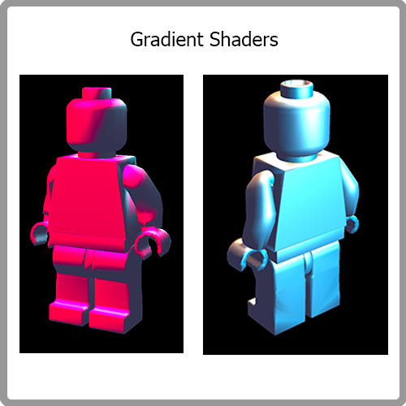

# CS184 Project 2 MeshEdit
## Cyrus Vachha and Siming Liu
### Spring 2022 

### URL: https://cal-cs184-student.github.io/sp22-project-webpages-cvachha/proj2/

## Overview
Overview

## Section I: Bezier Curves and Surfaces

### Part 1: Bezier curves with 1D de Casteljau subdivision

**Briefly explain de Casteljau's algorithm**

Given a group of control points, we interpolate each pair of neighbor points with parameter t and get a group of subdivision control points. Recursively perform this procedure until there is only one point left. This point is definitely on the bezier curve defined by the original control points.

**How you implemented it in order to evaluate Bezier curves.**

We mainly implemented the function called `evaluateStep()` and here is what we do in this function:

Step 1: We first create a empty vector named `subDivisionLevelCtrlPts`

Step 2: For one control point Pi and its next neighbor control point Pi+1, we perform an interpolation with parameter t to get a subdivision of these two control points and push_back it into `subDivisionLevelCtrlPts`.

Step 3: After all the subdivision control points are pushed into `subDivisionLevelCtrlPts`, we return this vector.

This function is used to generate the next one level subdivision of the given group of control points. The program control how many level of subdivisions are generated by a variable. Pressing `E` will increase the value of that variable by 1, which means that we can determine how many level of subdivisions to show. In order to evaluate the correctness of the bezier curve, we press `E` for multiple times until there is only one point in the last subdivision. If that point is on the curve, it means the curve is correct. 

### Part 2: Bezier surfaces with separable 1D de Casteljau 

**Briefly explain how de Casteljau algorithm extends to Bezier surfaces.**

Suppose a Bezier surface has M*N control points and we would like to get the translation of a point at (u,v). We first treat each row’s control point as the control point of that row’s bezier curve and then we calculate the point at each row with parameter u. For all M rows, we can get M points. And then we treat these M points as the control point of a bezier curve and calculate the point at parameter v. And this is the point we want.

**How you implemented it in order to evaluate Bezier surfaces.**

I implement Bezier surface mainly using the following three functions:

* `evaluateStep(ctrl_pts, t)`: return a vector of the next level subdivision control points give a vector of control points;

* `evalutate1D(ctrl_pts, t)`: iteratively call `evaluateStep()` until there is only one point in the returned vector and return that point;

* `evaluate(u,v)`: input is a n*n control point matrix P. Create a new vector named `v_ctrl_pts`. 

For each row Pi (a vector of n control points), call `evaluate1D(Pi, u)` using the row and u, and then push_back the returned point to `v_ctrl_pts`. Call `evaluate1D(v_ctrl_pts, v)` to get the answer.

## Section II: Triangle Meshes and Half-Edge Data Structure

### Part 3: Area-weighted vertex normals

**Briefly explain how you implemented the area-weighted vertex normals.**

The area-weighted vertex normals allow for smooth Phong shading on smooth surfaces. This is implemented by iterating over all faces connected to a specific vertex and summing the normal vector of each of these faces. The normalization of this summed vector results in the weighted area normal of the specific vertex. Essentially we get the halfedge of the specific vertex and iterate through the half edges. For each of the half edges we get the normals of the face from the halfedge.

By printing the vertex positions and using the mesh editor selection tools,  we could debug and check which faces were being used when iterating over the halfedge. One issue that occurred was that at one point half of the faces were dark since their normals/faces were flipped (if we zoomed inside the mesh those faces were shaded on the interior). This was fixed by using the normalize function provided with the `Vector3D` class.

### Part 4: Edge flip

**Briefly explain how you implemented the edge flip operation and describe any interesting implementation / debugging tricks you have used.**

To implement the edge flip operation, I first read the half-edge primer which included a resource on how the half-edge flip works including a labeled diagram that detailed how the face/vertex/edge structure changes. Then I listed the initial mesh components outlined in the diagram. Next, I typed out the reassignments of each component making sure to match them with their corresponding pointers and references to the other relevant components. At first, I had a bug where sometimes a face next to a flipped edge would disappear. I used the MeshEdit interface to keep track of which edges were flipping. I found that in the given dae folder, there were additional files for a cube with each of the operations applied. I then observed the input cube and the flipped edge cube sample files. I also noticed how the edge flips would appear and with which components belonged to each other (by making note of and printing the addresses of the vertices/edges). While debugging, I was unsure how to choose the halfedge of an edge but later realized that any halfedge or its twin would work. After fixing a few small mistakes in the reassignment, the flip operation worked. After testing it on the cube, I noticed that flipping certain edges would cause self intersecting geometry and overlapping faces. After looking over the code, we reasoned that this was expected behavior of the flip operation since the edge flip was still reversible. I also tested this on the teapot and other meshes and the flipping seemed to work

### Part 5: Edge split

**Briefly explain how you implemented the edge split operation.**

Actually, I drew a figure of how those edges, vertices and halfedges change in an edge split operation. Just like the following figure. And then I divide this function into two parts:

* Use pointers to point to all elements related in this operation, including new elements that will be created in this operation;

* Reassign the pointers in all these elements according to the figure.

**Describe any interesting implementation / debugging tricks you have used.**

During the implementation, I encountered a bug that my f3 didn’t show up after an `edgeSplit`. So I use `check_for()` on f3 and all its related elements to see what happened and then I found that one of the halfedge’s `next()` pointed to a wrong halfedge. After I corrected it, everything works fine. So I think `check_for()` the strangely behaviored elements can be a good debugging trick.

**Boundary Edge Split (Extra Credit)**

Edge split on boundary cases is a little bit different from inner cases. Suppose we are going to split edge e0 on the boundary. Our main idea is shown in the following picture. 

How to create new elements and reassign pointers is very similar to what we do for inner cases. However, there is one specific element that we need to pay attention to is h_x, which is shown at the bottom of the above figure. If we don’t update h_x->next(), the programme will not work properly. In fact, we didn’t do that at first and our loop subdivision could only perform 1 level subdivision and any higher level will crash the programme.

Here are some results of boundary edge split. (we used beetle.dae here)

We can see that some boundary edges (at the bottom of the figure) are successfully splitted.

### Part 6: Loop subdivision for mesh upsampling

**Briefly explain how you implemented the loop subdivision**

I implement loop subdivision in the following steps:

1.  I calculated the new position for all vertices in the original mesh and stored them in `Vertex::newPosition`. I also set the isNew value of each vertex to false.

2. I set all edges’ `isNew` to false.

3. I split all the edges in the original mesh and assign `true` to the `isNew` value of newly created edges that does not overlap on original edges. I also calculated the new position of the newly created vertices during edge split.

4. I flip the edges that connect an original vertex to a new vertex.

5. I assign each vertex’s `newPosition` to its position.

**Describe any interesting implementation / debugging tricks you have used.**

I added some output when traversing the original edges to check if there was a dead loop.

**Take some notes, as well as some screenshots, of your observations on how meshes behave after loop subdivision. What happens to sharp corners and edges? Can you reduce this effect by pre-splitting some edges?**

The sharp corners and edges became smooth and sphere-like after loop subdivision.

In order to reduce this smooth effect on the corner, I pre-split all edges that connect to a corner vertex. As is shown in the figure below, after this preprocess, the sharp feature is somewhat preserved after several levels of loop subdivision. It’s kind of isolating the corner with other corners, so during the smoothing operation, the signal response of that corner is somewhat preserved.

**Can you pre-process the cube with edge flips and splits so that the cube subdivides symmetrically?**
Yes

**Extra Credit Boundary Cases**

In our opinion, the most important part for boundary cases in loop subdivision is how to calculate the new position for boundary vertices. In our implementation, we apply the following rules for updating positions of boundary vertices:

We implemented these rules according to the following articles and website:
[1] https://graphics.stanford.edu/~mdfisher/subdivision.html
[2] Anisimov, Dmitry & Deng, Chongyang & Hormann, Kai. (2016). Subdividing barycentric coordinates. Computer Aided Geometric Design. 43. 10.1016/j.cagd.2016.02.005. 

## Section III: Optional, possible extra credit

### Part 7: Design and edit your own mesh!

**Shaders**

