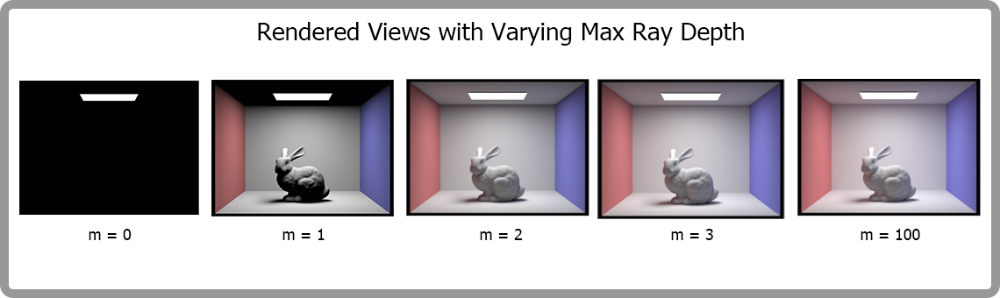

# CS184 Project 3-1 Rasterizer
## Cyrus Vachha and Siming Liu
### Spring 2022 

### URL: https://cal-cs184-student.github.io/sp22-project-webpages-cvachha/proj3-1/

## Overview
In this project, 

## Part 1: Ray Generation and Scene Intersection

**Walk through the ray generation and primitive intersection parts of the rendering pipeline**

Ray generation is an important part of geometric modeling. We generate a ray by setting its original position and ray direction. In our implementation for class Camera’s `generate_ray()` function, we first find the corresponding position in the camera's sensor plane given a pixel and calculate the direction vector in the camera’s coordinates. Then we convert this direction vector from the camera's coordinates to the world coordinates by left-multiplying the `o2w` matrix. Note that, as cameras have clipping planes, we also have to set the nClip and fClip for each ray we generate.

Primitive intersection is usually needed in ray tracing. It tells us whether a ray we generate intersects with any primitives in our scene and thus determines how we perform rendering. In our code base, we implemented the ray-triangle intersection, ray-sphere intersection and ray-bbox intersection functions.

**Explain the triangle intersection algorithm you implemented in your own words**

In the Ray-Triangle intersection function, our implementation can be described in the following steps:

1. We test if the intersection point is within the triangle using Möller–Trumbore ray-triangle intersection algorithm described in [this slide](https://cs184.eecs.berkeley.edu/sp22/lecture/9-22/ray-tracing). And we can get the value of t and barycentric interpolation coefficients b1, b2 and b3 for P1,P2 and P3. 

2. We check if the t is within the ray’s min_t and max_t range. If not, we return false; otherwise, we go to STEP 3;

3. We check if all the interpolation coefficients are within [0,1]. If not, we return false; otherwise, we go to STEP 4;

4. We set the ray’s max_t to this intersection’s t value and update the `*isect` object correspondingly.

**Show images with normal shading for a few small .dae files**

**An interesting problem we met in this part**

In our first version of triangle-ray intersection implementation, we first calculated the ray-plane intersection according to [this slide](https://cs184.eecs.berkeley.edu/sp22/lecture/9-20/ray-tracing). However, we use the normal of the vertices as the normal of the plane. Although, sometimes they are equal, they are not supposed to be the same thing and  some faces in the scene could disappear when viewed from some specific angles in this way of rendering (just like the CBgems shown below)

We solve this by using (p2-p1)×(p3-p1) as the face’s normal vector. Also, if we directly use the result given by Möller–Trumbore ray-triangle intersection algorithm, the problem will not take place as well. Here is a rendering of the CBgems after we fixed the problem:

## Part 2: Bounding Volume Hierarchy

**Walk through your BVH construction algorithm**

We implemented the BVH construction algorithm in a recursive way. For a given node, we first check if the number of primitives it has exceeds the `max_leaf_size` we set. If not, then we treat it as a leaf node and set its bounding box, start and end primitive iterator and then return the node; otherwise, we split the node into two child nodes and perform BVH construction on the left and right node.

**Explain the heuristic you chose for picking the splitting point.**

We choose the splitting point in the following way:

1. First, we calculate the size of the node’s bounding box and choose its longest dimension as the dimension that we will split on.

2. Secondly, we sort the primitives by their center’s projected value along the dimension we choose and pick the median value.

3. At last, we use the median value to split the primitives into two groups. 

**Show images with normal shading for a few large .dae files that you can only render with BVH acceleration.**

**Compare rendering times on a few scenes with moderately complex geometries with and without BVH acceleration. Present your results in a one-paragraph analysis.**

| File name   | Without BVH | With BVH |
| ----------- | ----------- | -------- |
| cow.dae      | 38.71s     | 0.05s    |
| teapot.dae   | 21.27s     | 0.06s    |

As we can see from the table, rendering with bvh can boost the rendering speed by 3~4 magnitude. Actually, the rendering time for some very complex .dae files (like the `maxplanck.dae` file) is quite similar to those moderately complex files (also within 0.1s). So the bvh structure is very efficient in calculating ray-primitive intersection.

## Part 3: Direct Illumination

**Walk through both implementations of the direct lighting function**

In Task 3 and 4 we implemented two forms of direct lighting: with uniform hemisphere sampling and with importance sampling. In uniform hemisphere sampling, we sample from light from a hemisphere of directions, while in importance sampling we sample directly from the light sources.

#### Direct Lighting with Uniform Hemisphere Sampling

We implemented Direct Lighting with Uniform Hemisphere Sampling by using Monte-Carlo to estimate the radiance by taking num_samples lighting samples of incoming rays in `estimate_direct_lighting_hemisphere`. 

We do this by first sampling a direction from the given `hemisphereSampler` which returns a random vector direction with pdf 1/2π. Next, we create a new ray with our sampled direction originating at the hit point (we transformed our ray direction from object to world coordinates). If there is an intersection from that ray, we find the emissive component of the bsdf of the new intersected object. We then evaluate the bsdf of the current object (f_r) which is the albedo of the Lambert material divided by a constant.

Given these values, we use the reflection equation and find the radiance as: (emission value) * f_r * cos(w_i)/p(w_i).

Finally, we find and return the average of these values as `L_out` which gives us an unbiased estimate of the radiance.

#### Direct Lighting by Importance Sampling Lights

We implemented importance sampling by iterating over all the lights in the scene and sampling from them to estimate the radiance in `estimate_direct_lighting_importance`.

For each light, we check whether it is a point light (delta light) or an area light. If it is a point light, we only sample once, else we sample `ns_area_light number` of times. 

We first find the radiance of the light source using `samle_L` which also gives us the direction (wi) and the pdf. Next, we cast a ray from the hit point in the direction of wi (this is our shadow ray) and check if there is an intersection (we transformed our ray direction from world to object coordinates). If there is an intersection before the ray hits the light source, we record the sample as 0. If there isn’t an intersection, we find the radiance using the reflection function as: ns_area_light * (radiance of the light source)* f_r * cos(w_i)/p(w_i).

Finally, we find and return the average of these values as `L_out` which gives us an unbiased estimate of the radiance from importance sampling.

After completing this function, we modified `one_bounce_radiance` to call either hemisphere sampling or importance sampling based on the given parameters. We also modified `est_radiance_global_illumination` to return the radiance of zero bounce radiance + one bounce radiance.

**Show some images rendered with both implementations of the direct lighting function**

**Focus on one particular scene with at least one area light and compare the noise levels in soft shadows when rendering with 1, 4, 16, and 64 light rays (the -l flag) and with 1 sample per pixel (the -s flag) using light sampling, not uniform hemisphere sampling**

**Compare the results between uniform hemisphere sampling and lighting sampling in a one-paragraph analysis**

From the above renders, there is a significantly more amount of noise in the uniform sampling compared to the importance sampling. This is in importance sampling, we are only observing the sampling distribution from the lights themselves rather than random directions across the hemisphere. The uniform sampling is noisy since we are randomly sampling different random directions at each pixel and some of them don’t hit the light source so the radiance is zero for some directions); possibly, only a few of them actually hit the light source.
In importance sampling, we only sample the rays from the directions of the light sources so our radiance is non-zero and our directions actually hit the light source. The light sources will contribute most to the Monte Carlo estimate. Additionally, importance sampling allows for point lights to be visible in the scene.

Looking at the uniformed sampled render, in areas where the diffuse of the lambert material is lighter, the noise is more noticeable and the noise is not noticeable over light sources or the top of the box. In the importance sampled render, due to the lack of noise, the render looks like it is at a higher resolution and the shadow appears softer. Most noticeable, the walls are very clear and appear smooth due to the lack of noise.

## Part 4: Global Illumination

**Walk through your implementation of the indirect lighting function**

We implement the indirect lighting function in a recursive way. Within each recursive call:

1. We first get the depth of the input ray. If the `ray_depth` reach the `max_ray_depth` we set, return `L_out`; otherwise, we increment the `ray_depth` by 1 and create a new_ray start at `hit_p` and randomly sample its direction.

2. Then we calculate the intersection point of the input ray. If there is no intersection between the ray and the scene, we return false; otherwise, we calculate the `one_bounce_radiance` at this intersection point (`hit_p`) and assign the value to `L_out`.

3. We calculate the intersection between this new_ray and the whole scene. If there is no intersection, we return `L_out`; otherwise, we update the intersection information and do a Russian Roulette;

4. In Russian Roulette, we use the given function called `coin_flip` to decide whether to recurse again or stop. The termination probability we choose is 0.3.

5. If the function is not gonna terminate, we call the function itself again and input the `new_ray` and the updated intersection information.

**Show some images rendered with global (direct and indirect) illumination. Use 1024 samples per pixel**

**Pick one scene and compare rendered views first with only direct illumination, then only indirect illumination. Use 1024 samples per pixel. (You will have to edit PathTracer::at_least_one_bounce_radiance(...) in your code to generate these views.)**

Take CBbunny.dae as an example. We can see that the ceiling of the Cornell box is totally dark in direct illumination while that in indirect-only illumination is bright. Another important difference is that we can see the red and blue color on the bunny statue, ceiling and shadow areas, which can be attributed to the light rays bouncing from the wall to those areas. But in direct illumination, color is more monotonous.

**For CBbunny.dae, compare rendered views with max_ray_depth set to 0, 1, 2, 3, and 100 (the -m flag). Use 1024 samples per pixel**

As we can see from the above renderings, the scene becomes brighter and brighter with `max_ray_depth` increase. To be specific, m=0 corresponds to zero_bounce condition and m=1 corresponds to direct illumination condition. When m>1, global illumination begins to take effect and the shading becomes more smooth.

**Pick one scene and compare rendered views with various sample-per-pixel rates, including at least 1, 2, 4, 8, 16, 64, and 1024. Use 4 light rays**

Comparing the above renderings, we notice that there is less and less noise with the number of samples per pixel goes up. Scenes rendered with small s are quite noisy that they look like some very old photos.

## Part 5: Adaptive Sampling

**Walk through your implementation of the adaptive sampling**

In order to implement the adaptive sampling, we made some modifications to the `raytrace_pixel()` function we implemented in part 1. We count the number of samples we’ve already sampled and when it reaches the multiple of `samplesPerBatch`, we calculate the average and deviation of the samples we get. Then we calculated the `I` and compare it to `maxTolerance⋅μ`, if `I` < `maxTolerance⋅μ`, then we stop sampling and store the number of samples into `sampleCountBuffer`; otherwise, we keep sampling until the number of samples reaches the max limit we set.

**Pick one scene and render it with at least 2048 samples per pixel. Show a good sampling rate image with clearly visible differences in sampling rate over various regions and pixels. Include both your sample rate image, which shows your how your adaptive sampling changes depending on which part of the image you are rendering, and your noise-free rendered result. Use 1 sample per light and at least 5 for max ray depth**

As is shown in the right figure, ceiling, bunny and shadow areas need more samples to converge than the wall and floor.

