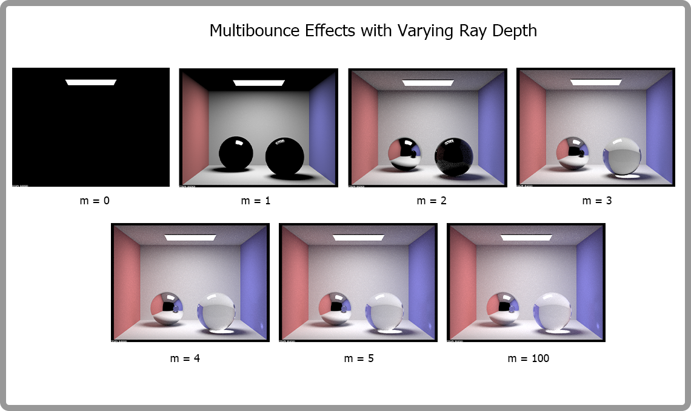
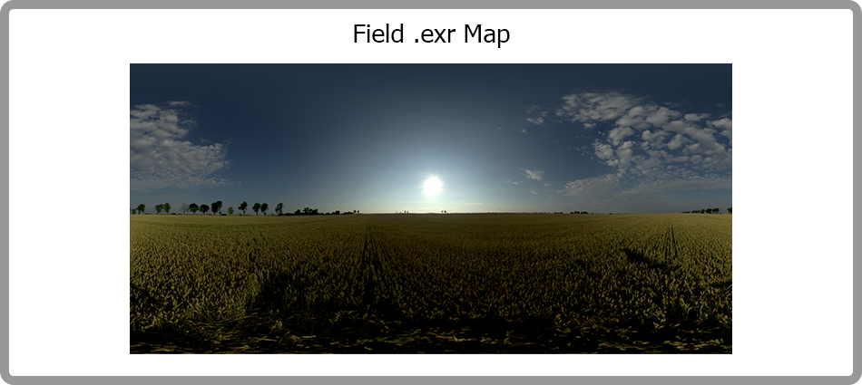
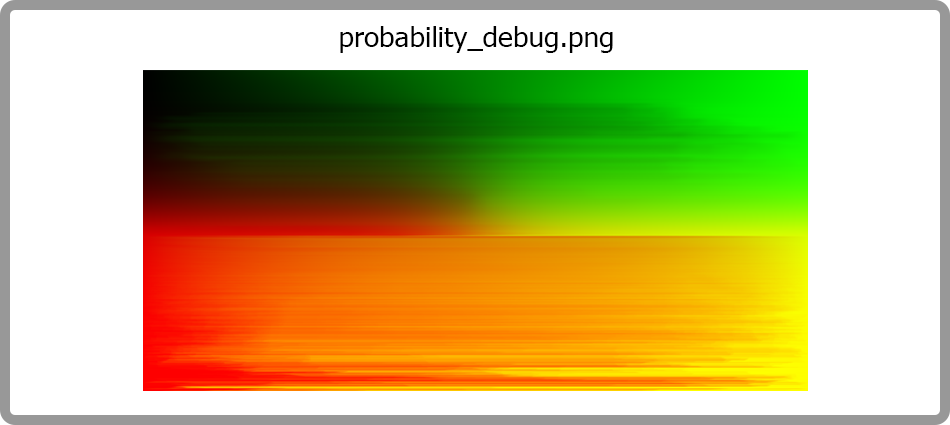
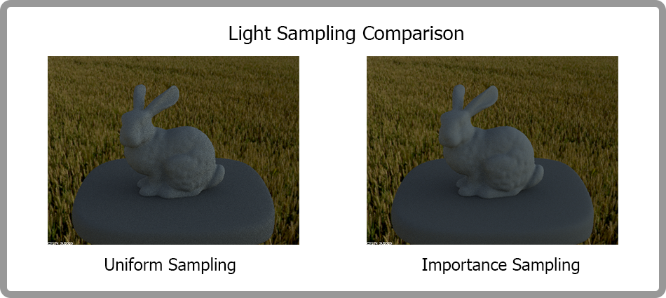
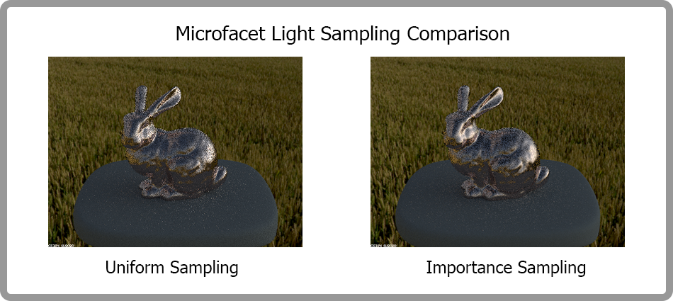
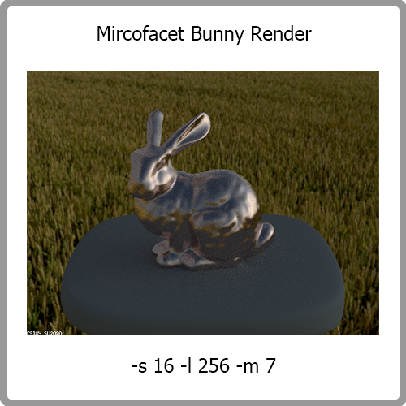
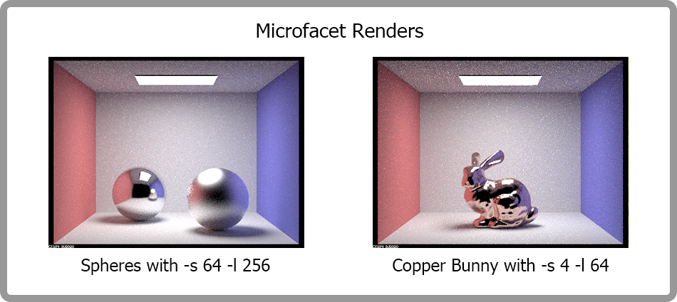

# CS184 Project 3-2 Pathtracer Part 2
## Cyrus Vachha and Siming Liu
### Spring 2022 

### URL: https://cal-cs184-student.github.io/sp22-project-webpages-cvachha/proj3-2/

## Overview

In this project, we play with three kinds of surface materials, including glass, macrofacet and mirror material, and have a better understanding of how those different materials affect the lighting effects. In addition, we also implement the environment lighting via uniform sampling and importance sampling. We find this project interesting because we can almost render anything with any material in any background after finishing this project.
Learning how these materials worked allows us to further explore light optics in rendering. The reflection and refraction of light in the mirror and glass materials is something we observe on a daily basis, and implementing the materials gives us a more complete understanding of how light interacts with objects in the real world. The environmental lighting capability allows us to relight almost any object in a realistic way and gives us an insight into how realistic rendering in films is done. 

## Part 1: Mirror and Glass Materials

**Implementation**

For this part, we implemented mirror and glass materials which demonstrate the lighting properties of reflection and refraction. To create the mirror material, we implemented reflection by updating the `MirrorBSDF::samlple_f()` and `BSDF::reflect()` functions which handle sampling and computing of the angle of reflected light rays. The mirror material only reflects the scene. 

To create the glass material we implement the `RefractionBSDF::sample_f()` and `BSDF::refract` functions to implement the refraction property. We use Snell’s equations which demonstrate that the light changes direction based on the index of refraction. Based on the direction of the incoming and outgoing materials the ray travels through, we adapt the equations and indexes of refraction in the equations. We combine the reflection and refractive properties to create the glass material in `GlassBSDF::sample_f()`. We also take into account when total internal reflection occurs to accordingly reflect the light. We compute Schlick’s reflection coefficient to determine when to reflect or refract light. Combining these conditions gives us a realistic rendered glass material. These effects are only visible after a certain number of ray bounces.

**Show a sequence of six images of scene CBspheres.dae rendered with max_ray_depth set to 0, 1, 2, 3, 4, 5, and 100. The other settings should be at least 64 samples per pixel and 4 samples per light.**

**Point out the new multibounce effects that appear in each image.**

When m = 0, the only lighting visible is from the area light source. When there is one bounce of lighting at m = 1, we see direct lighting and the spheres are black since they are not reflecting any bounced light. 

When m = 2, we start to notice the multibounce lighting effects in the scene with global illumination. with first noticing that the sphere with the mirror material reflects the environment previously found from direct lighting (m = 1). We also start to see the glass sphere partially reflects the environment from m = 1. Shadows of the spheres are slightly colored.

At m = 3, we observe the mirror ball now reflects the environment from m = 2 so in its reflection, we observe the lit ceiling and reflections on the glass ball. With the glass ball, we now can see through the refraction of the sphere and see a large bright area in the shadow from the light going through it.

At m = 4, we now see that the mirror sphere reflects the environment of m=3, so the glass ball refraction is visible. On the glass ball, we also observe a slight reflection of the bright spot on the shadow on the surface of the ball. There is also a small lit spot on the right wall coming from the glass sphere.

At m = 5 and m = 100, there is not much of a discernible difference as the image converges, but the light continues to travel in the same paths and some places get a little brighter. 

**Explain how these bounce numbers relate to the particular effects that appear.**

As the bounce numbers increase, we see the new effects appear since the glass and mirror materials show reflections and refractions of light which require multiple bounces to demonstrate their properties. As the number of bounces increases, we start to see the mirror and glass materials more visible. The mirror sphere reflects the environment of the previous m-1 bounce environment. It takes three bounces for the glass sphere to refract the light. Additional effects occur as the light reflects further in the scene and in between the spheres.

## Part 3: Environment Light

**Pick one .exr file to use for all subparts here. Include a converted .jpg of it in your website so we know what map you are using.**

**In a few sentences, explain the ideas behind environment lighting (i.e. why we do it/how it works).**

We perform the environment lighting in order to simulate the effect of lights coming from the surroundings and generate a more realistic scene. 

The main idea of environment lighting is that we generate a sample direction from a given point and then use the direction to look up the radiance and pdf in the texture map of the background.

Here is a brief description of how we implemented environment lighting. 

First, we implemented the function named `sample_dir()`. In this function, we get the corresponding value in the environment map by converting the input ray’s direction vector into theta_phi and then xy via helper functions.

Then we implemented `sample_L()` using uniform sampling. In this function, we uniformly sample a direction from a sphere and set the pdf to 1/4pi. After that we convert the direction vector and get the corresponding radiance from the envMap.

Finally, we implemented `sample_L()` using importance sampling. We went through some problems in this step (mainly black regions in the rendering of the bunny) and almost all of the problems had something to do with probability calculation. Once we got all the probabilities correct, the black regions just disappeared.

**Show the `probability_debug.png` file for the .exr file you are using, generated using the `save_probability_debug()` helper function after initializing your probability distributions.**

**Use the `bunny_unlit.dae` scene and your environment map .exr file and render two pictures, one with uniform sampling and one with importance sampling. Use 4 samples per pixel and 64 samples per light in each. Compare noise levels.**

Comparing the bunny generated by uniform sampling and importance sampling, we can see that the rendering with importance sampling has less noise. We think this is because importance sampling is more efficient than uniform sampling and there are more sampled rays that point to the bright area of the environment. 

**Use a different image (if you did part 2, we recommend `bunny_microfacet_cu_unlit.dae`) and your environment map .exr file and render two pictures, one with uniform sampling and one with importance sampling. Use 4 samples per pixel and 64 samples per light in each. Compare noise levels.**

We successfully implemented part 2 and use bunny_microfacet_cu_unlit.dae here for this comparison. The figures below are the rendering of bunny_microfacet_cu_unlit.dae in field.exr. 

We can see from these two results that a bunny with importance sampling has less noise than that with uniform sampling. The number and energy of sparkling points also decrease in importance sampling.

We also generated a more visually appealing figure with a higher sample rate (-s 16 -l 256).

## Part 2 (extra)

**Note that we are not using part 2 for grading and we only use this part for more visual results in part 3. So we won’t talk about many details here and only give some results of some scenes with marcofacet material objects using importance sampling.**

