# CS184 Project 4 Clothsim
## Cyrus Vachha and Siming Liu
### Spring 2022 

### URL: https://cal-cs184-student.github.io/sp22-project-webpages-cvachha/proj4/

## Overview

In this assignment, we simulate some basic physics scenes of cloth including the pure cloth mesh, hanging by two pinned corners, falling on the plane, covering a ball, self-collision and different shaders. In order to simulate the physics, we build a grid of pointMass objects and add strings between them to represent the cloth. To accelerate the collision check, we voxelize the space into boxes and build a spatial hash map that maps each point into its closest box, after which we only need to check the corresponding box for a given point for collision check. We create simulations for the cloth to interact with planes, spheres, and itself by mainupulating pointMass positions. We then implement six GLSL shader materials commonly found in computer graphics rendering: diffuse, blinn-phong, texture mapping, bump, displacement, and mirror/environmental reflective. Using the geometery and camera properties, we can create these different materials. We find this project helpful in reinforcing how different kinds of meshes can be created and this introduces us to physical simulations. We also find it interesting to implement shaders that are commonly used in graphics rendering/animation.

## Part 1: Masses and springs

**Implementation**

In this part, we first initialize all the pointMass with its corresponding position and put them into a vector. And then we traverse all the pointMass and create all the strings. 

We also met a very interesting problem in the initialization part. At the beginning, we used the same random z value for a vertical cloth, which resulted in the cloth standing on the plane rather than falling down in the beginning of part 4. After we assigned each point a different z value, the problem in part 4 was solved.

**Take some screenshots of scene/pinned2.json from a viewing angle where you can clearly see the cloth wireframe to show the structure of your point masses and springs.**

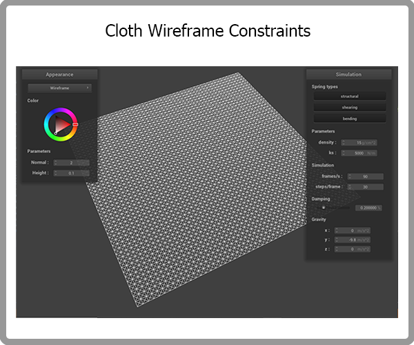

**Show us what the wireframe looks like (1) without any shearing constraints, (2) with only shearing constraints, and (3) with all constraints.**

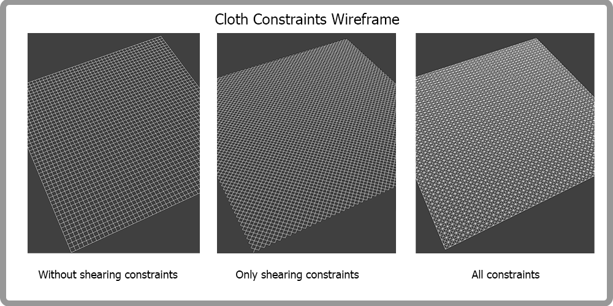

## Part 2: Simulation via numerical integration

**Implementation**

In this part, we simulate the falling down process of a piece of cloth with two corners pinned. The implementation of this part can be mainly divided into three phases: 
1. Apply Forces (external force + internal force):
In this phase, we first calculate all the external forces via external acceleration times the mass of each point. Then we calculate the internal force by traversing all the spring objects and using Hooke's Law.

2. Move point mass:
We update the position of each point mass via Verlet integration. We first calculate the acceleration of each point mass using force/mass. And then we approximate the integration using the last and current position, time step and the acceleration, with loss of energy considered and represented via a damping term d.

3. Constrain position updates:
We follow the idea of SIGGRAPH 1995 Provot paper to add constraints on the length of springs at the end of each time step during the simulation. For each spring, we hope the result length won’t be 10% longer than the rest length. The exceeding part of all the springs connected to a point mass will be added to the correction vector. After the correction vector is calculated, we adjust the position of the point mass by adding the correction vector to the last position of the point mass..

**Describe the effects of changing the spring constant `ks`; how does the cloth behave from start to rest with a very low `ks`? A high `ks`?**

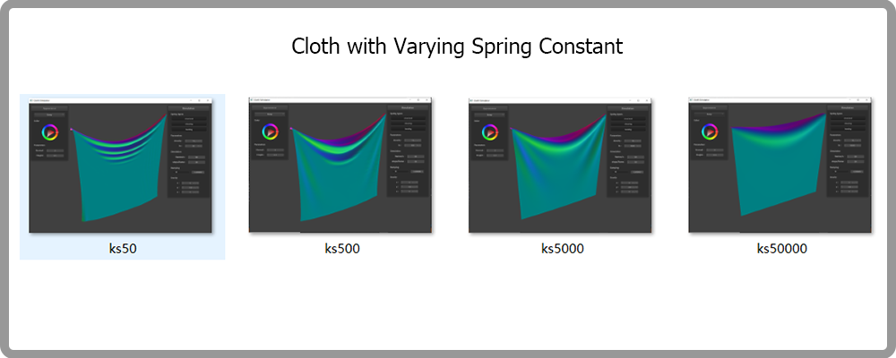

The higher the ks, the larger the amplitude of the waves on the cloth during the process of falling down.

**What about for density?**

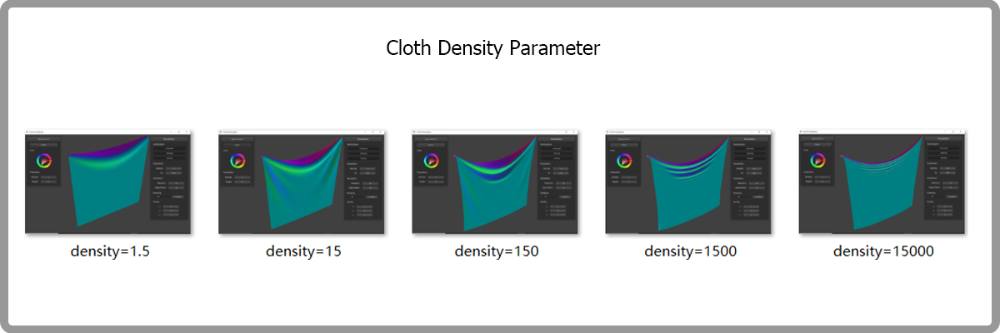

The higher the density, the deeper the valley between the two pinned corners. The higher the density, the more visible waves during the process of falling down.

**What about for damping?**

The higher the damping value, the slower the speed of falling down and less turbulence near the end of the process (or when the bottom of the cloth reaches the lowest height). 

**For each of the above, observe any noticeable differences in the cloth compared to the default parameters and show us some screenshots of those interesting differences and describe when they occur.**

`Ks`: cloth with smaller `ks` will have a deeper valley between the two pinned corners after rest.
Other differences are described in the above question’s answer and provided in above images.

**Show us a screenshot of your shaded cloth from scene/pinned4.json in its final resting state! If you choose to use different parameters than the default ones, please list them.**

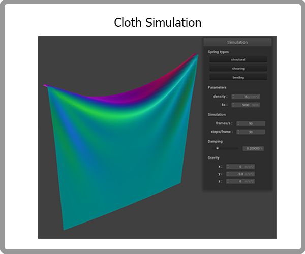

## Part 3: Handling collisions with other objects

**Implementation**

We implemented collision with a sphere by first checking whether the plane is intersecting with the sphere. We did this by checking if the distance between a point mass and the origin is less than the radius of the sphere. If an intersection is detected, we adjust the position of the pointmass to be the offset distance of  the last pointmass position to the surface of the sphere and apply a friction scaling. Then, we called the collision function from every object onto every point mass in cloth.cpp to apply every collider’s force to every pointmass. 

We implemented the collision with a plane by checking if the cloth point mass positions have gone through the ground plane. We did this by creating a line from the last position and current position of the point mass and checking where across the t value is the plane intersection located. If the t-value is between 0 and 1, we can tell that the planes have intersected. If an intersection is found, we assign the point mass position to be slightly above the plane by `SURFACE_OFFSET` and apply a friction scaling.

In the sphere’s collision check, we met a problem that the cloth slipped down the ball right after it fell onto the ball, given a normal steps/frame. This is because we also applied the correction vector to the last_position of the pointMass objects. After we commented out that line, everything worked fine.

**Show us screenshots of your shaded cloth from scene/sphere.json in its final resting state on the sphere using the default `ks` = 5000 as well as with `ks` = 500 and `ks` = 50000. Describe the differences in the results.**

When we set the `ks` = 500, we see that the cloth droops further and is longer. As ks increases up to 50000, the cloth becomes more rigid and less loose. This is because we are changing the spring constant k which represents how rigid the spring is according to Hooke’s law.

**Show us a screenshot of your shaded cloth lying peacefully at rest on the plane. If you haven't by now, feel free to express your colorful creativity with the cloth! (You will need to complete the shaders portion first to show custom colors.)**

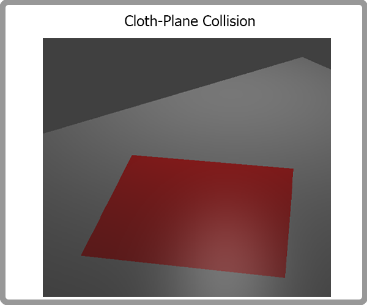

Here the cloth with a red phong material is resting on a plane.

## Part 4: Handling self-collisions

**Implementation**

In this part, we implemented the space hashing and self-collision check. The basic idea is that we voxelize the space into boxes and assign each point to its closest box, after which, when checking collision, we only need to check the objects in the corresponding boxes.

**Show us at least 3 screenshots that document how your cloth falls and folds on itself, starting with an early, initial self-collision and ending with the cloth at a more restful state (even if it is still slightly bouncy on the ground).**

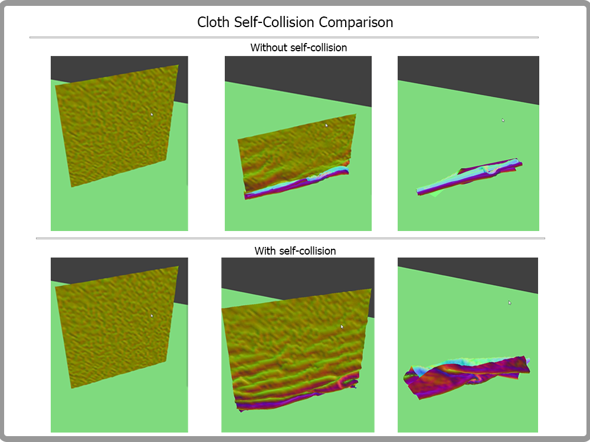

We can clearly see that, without self collision check, a corner of the cloth penetrate through itself near the end of the simulation.

After we apply the self-collision check, the cloth will normally fold and one part can layer on the others rather than penetrate.

**Vary the density as well as ks and describe with words and screenshots how they affect the behavior of the cloth as it falls on itself.**

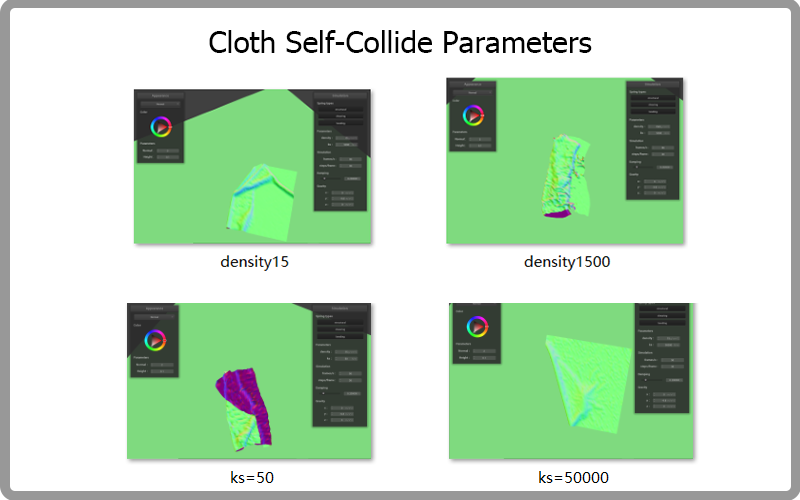

The higher the density the less likely the cloth will expand into a large area after falling onto the plane.

The higher the ks, the more like that the cloth will expand into a larger area and tends to recover into its original shape.

## Part 5: Shaders

**Implementation**

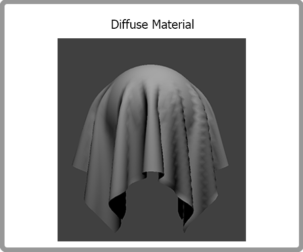

**Diffuse:** To implement diffuse shading, we used the given diffuse lighting equation from lecture (L_d = k_d(I/r^2)max(0,n \* l). Given the normal vector, and the positions of the light and vertices we can find the output color based on the light intensity. We also assigned k_d, the diffuse constant to be u_color, which is the input color wheel in the GUI to allow users to change the color.

**Phong:** To implement the blinn-phong shader, we used the given equation from lecture (L = k_a\*I_a + k_d (I/r^2) max(0,n \*l) + k_s(I/r^2)max(0,n\*h)^p. This equation is composed of the ambient, diffuse, and specular components which in combination account for the full blinn-phong shader. The specular component depends on the camera position and the diffuse component is the same as the previous diffuse shader.

**Texture:** To implement the texture shader, we sampled the given texture with the given uv coordinates to properly view the image across the mesh which was about a line. We noticed that the textures must be a square shape for it to look proper.

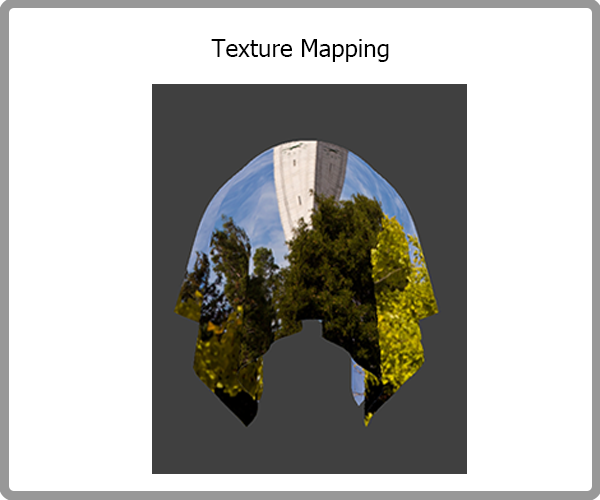

**Bump:** To implement the bump shader, we first computed the tangent-bitangent-normal (TBN) matrix which allows us to calculate the vectors in model space. To compute this, we converted the normal and tangent vectors to vec3 and found the b vector (their cross product). Next, we calculated dU and dV which represents the change in the normal magnitude in the u and v axis based on the bump map (we used the red component from the bump map). We then multiply the original normal vector with the TBN to get the displaced normal vector by matrix vector multiplication. Finally, we re-use the blinn-phong shader and use the new displaced normal vector. The result is that the shader makes it appear there is additional texturing and detail on mesh.

**Displacement:** To implement the displacement shader, we re-used the bump shader in the previous part for the displacement.frag (to output the color). We then followed the same steps to calculate the displaced normal and then modify the gl_Position to move the vertex position along the displaced normal based on the red chanel of the displacement map texture using the given equation: p’ = p+n\*h(u,v)\*k_h.

**Environment-mapped Reflections:** To implement the environment-mapped mirror shader, we first calculated the outgoing eye-ray w_o (based on the camera and vertex positions) and reflected it across the vertex normal and sampled this incoming vector from the environment cubemap image. We noticed an issue where the mirror shader did not reflect properly in the selfCollision scene. We fixed this by normalizing the vec3 version of `v_normal`.

**Explain in your own words what is a shader program and how vertex and fragment shaders work together to create lighting and material effects.**

A shader program is used to create materials and shading in scenes with 3D objects which uses the GPU. In this project we implement these materials in GLSL which is composed of vertex shaders and framgent shaders. The vertex shaders influence the mesh such as manipulating vertex positions or normals. The fragment shaders output the final color of the view given the attributes from the vertex shader. In combination, these shaders can create intricate materials based on the geometric components of a mesh. 

**Explain the Blinn-Phong shading model in your own words. Show a screenshot of your Blinn-Phong shader outputting only the ambient component, a screen shot only outputting the diffuse component, a screen shot only outputting the specular component, and one using the entire Blinn-Phong model.**

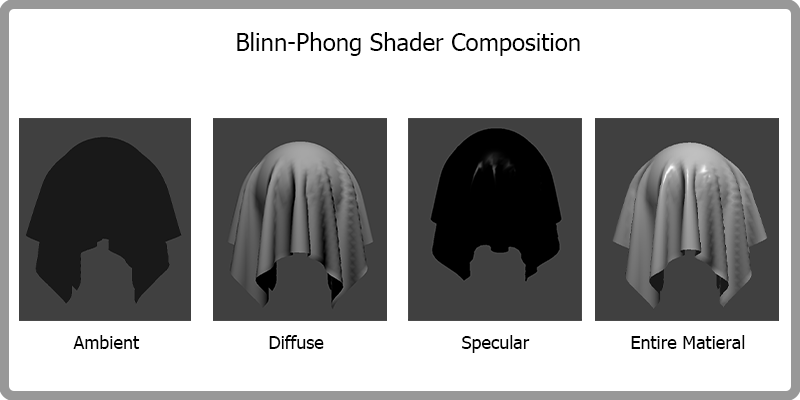

This material is composed of ambient, diffuse, and specular components which in combination account for the full blinn-phong shader. The specular component depends on the camera position and the diffuse component is the same as the previous diffuse shader. This makes it appear that there is a light source reflecting across the mesh.

**Show a screenshot of your texture mapping shader using your own custom texture by modifying the textures in /textures/.**

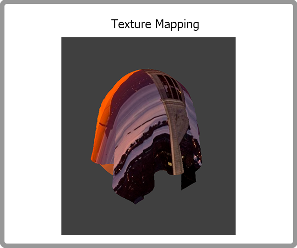

This is with a custom image texture.

**Show a screenshot of bump mapping on the cloth and on the sphere. Show a screenshot of displacement mapping on the sphere. Use the same texture for both renders. You can either provide your own texture or use one of the ones in the textures directory, BUT choose one that's not the default texture_2.png. Compare the two approaches and resulting renders in your own words. Compare how your the two shaders react to the sphere by changing the sphere mesh's coarseness by using -o 16 -a 16 and then -o 128 -a 128.**

We can see that the displacement map changes the geometry of the sphere and cloth.

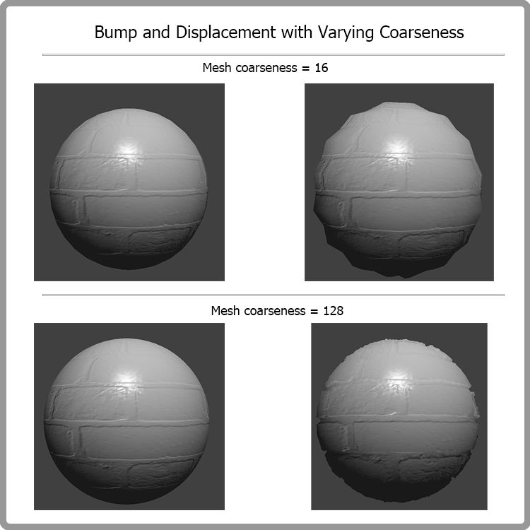

As we can see, as we increase the mesh resolution, the displacement map is more visible and we can see the hard edges of the brick pattern along the sphere with 128 coarseness. The sphere with a lower resolution (8 coarseness) is blockier and it is not able to properly display all the detail of the displacement map.

**Show a screenshot of your mirror shader on the cloth and on the sphere.**

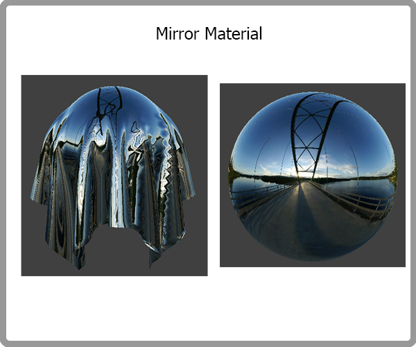

We can see that the shader is reflecting the cubemap environment.

**Explain what you did in your custom shader, if you made one.**

## Part 6: Extra Credit

